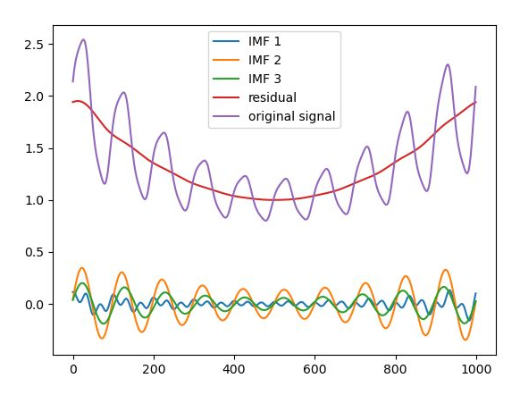

# FIF_C
C implementation of the Fast Iterative Filtering

### Dependencies ###

GNU C/C++ compiler
FFTW 3 library

The code has been written in C, but using some of the C++ standards, therefore it must be compiled using a c++ compiler

The code has been tested with the standard gcc and fftw3 library installed on ubuntu20.04

### Install ###
Simply compile by typing ``` make ```

Run by typing ``` ./test ```

plot results with ```python3 ./testfifc.py```  (requires numpy and pylab). You should obtain an image like this one




### Contacts ###
The C version of the FIF algorithm has been written by Igor Bertello - INAF (igor.bertello@inaf.it) and Emanuele Papini - INAF (emanuele.papini@inaf.it).

The original code and algorithm conceptualization are authored by Antonio Cicone - University of L'Aquila (antonio.cicone@univaq.it).

Please feel free to contact us would you need any help in getting FIF up and running.


### Acknowledgments ###
We acknowledge financial support from the Italian Space Agency under the contract ASI “LIMADOU Scienza+” n° 2020-31-HH.0

Would you use FIF in a scientific publication, please add a link to this repository.

We are always enthusiastic about discovering new applications of FIF to scientific as well as other fun problems, so please get in touch with us :)  


### Links ###
 http://people.disim.univaq.it/~antonio.cicone/Software.html

### References ###
1) A. Cicone, H. Zhou. [Numerical Analysis for Iterative Filtering with New Efficient Implementations Based on FFT.](https://arxiv.org/abs/1802.01359) Numerische Mathematik, 147 (1), pages 1-28, 2021. doi: 10.1007/s00211-020-01165-5
2) A. Cicone and E. Pellegrino. [Multivariate Fast Iterative Filtering for the decomposition of nonstationary signals.](https://arxiv.org/abs/1902.04860) IEEE Transactions on Signal Processing, Volume 70, pages 1521-1531, 2022. doi: 10.1109/TSP.2022.3157482
